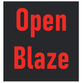

# OpenBlaze - the decentralized state framework aka appchain SDK.

OpenBlaze is appchain framework designed for bootstrapping app-specific state machines from very zero, without relying on another chains for security.

OpenBlaze contains functionality for p2p and consensus, using FwPoA consensus mechanism for fair and secure system bootstrapping and existance, also having extra-lite nodes support thanks to [DAN](https://github.com/angrymouse/papers/blob/main/data-access-networks.md)

[OpenBlaze SDK discord](https://discord.gg/WawAfjfn8p)

## Fixed-weight Proof-of-Authority (FwPoA)

There's 2 main types of consensus in nowadays blockchains: Proof-of-Work based (includes RandomX, NIPoPoW, SPoRA etc.) and DAO based (includes PoS and all its derivatives).

Both of them have advantages and disadvatages. For example PoW-based algorithms usually aren't as flexible as PoS-based ones (only can be used to fix transaction in time, not for something complex like managing account on other chain). 
PoS-like blockchains on other hand lack decentralization and are guided by plutocracy.

If we deconstruct PoS to basics, we can understand that it is not something else than autonomous DAO - DAO, which doesn't need chain for existing, instead it forms chain by itself.
PoS chains usually use token-based DAO system, where amount of tokens you have represents your voting power. 
However this system isn't perfect, as it creates plutocracy-driven system and is vulnerable to one entity buying big stake at the start of blockchain operation to manipulate this DAO later.
Every PoS after some time becomes dPoS (delegated PoS), on-chain (Cosmos, etc) or off-chain (Ethereum with Lido/Rocket Pool/CEX staking services).
dPoS inherits all of the PoS lacks and adds new: Now validators don't have to fear about their money being slashed, because it's not their money. All of their stake is constant income from inflation/commission. 
Because of reasons listed above PoS stays as algorithm that is mostly against crypto ethos and can be easily gamed.

Sometimes we can't use PoW, and so need more flexible system like PoS, but what can we do to avoid PoS lacks?
We can use another type of DAO - closed DAO without token representing voting weights, also known as "Multisig", where each participant has equal voting rights and it doesn't matter how many tokens he has.

If we think about it, all we want from validators is for them to not be sybil nodes - fake nodes manipulated by one entity to attack network.

It can be achieved relatively easy: We can have existing validators letting new validators enter based on their network footprint and social activity.
For example if somebody wants to enter network as validator, he can contribute to network's ecosystem, get familiar to some part of network's community, talk to existing validators, etc.
After he's known enough in network's community, he can ask validators who are already in validator set to let him in this set. If most of validators agree that he's not a bot/sybil attacker, they can let him in.
Note: Even if new validator doesn't have good intentions, it's still fine to let him in, as main point is just to keep sybil resistance.

This system destroys (while not being superior to PoW) destroys some lacks of PoS:
- Plutocracy 

In this DAO structure, amount of token person/validator has doesn't represent his voting power, so no problem of rich entities pushing their interests against community.
- Delegations

As money is not taking big participation in consensus, there's no possibility or sense to "stake" coins to some entity, as it doesn't change voting power or rewards, also more nodes can't be launched from "staked" money, so dPoS problem is defeated.
- High inflation

As there's no more "staking", there's also no need to give rewards to stakers, who de-facto aren't contributing to network operation. 
Now we can give good amount of coins to validators, while having inflation as low as possible.
- Low market cap vulnerability

As amount tokens doesn't matter for consensus anymore, there's no risk of someone buying huge part of tokens and taking over network.

